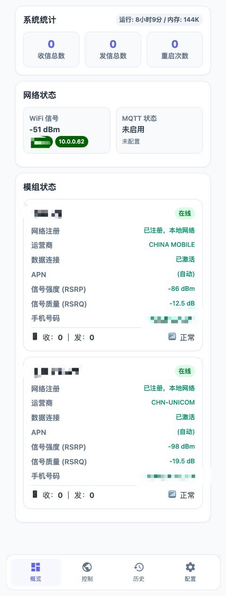
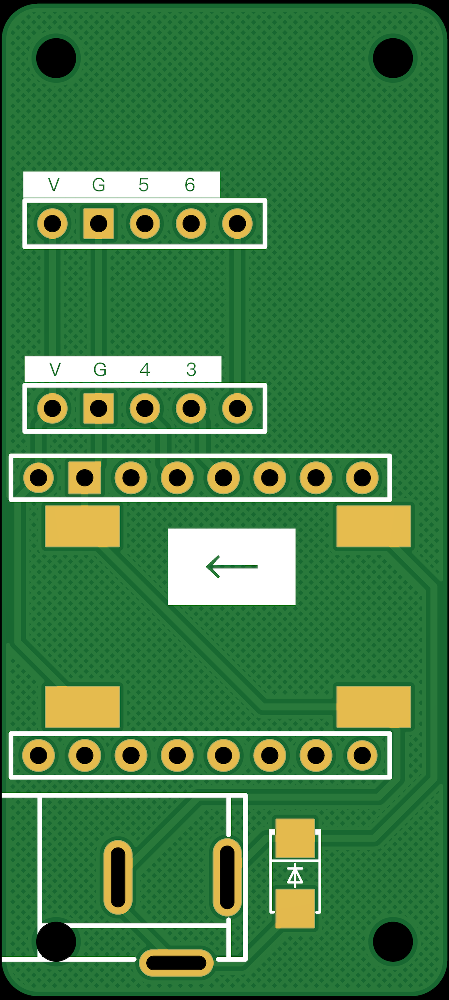

# 低成本——双短信转发器    ESP32-C3+ML307x2

用低成本硬件实现短信自动转发，只需要提供供电和WiFi即可，收到短信后自动推送到手机/邮箱/智能家居，再也不怕错过验证码！

> 本项目基于 [trah01/msg_forward](https://github.com/trah01/msg_forward) 进行二次开发，原项目采用 MIT 协议。感谢原作者 [@trah01](https://github.com/trah01) 的开源贡献！[trah01/msg_forward](https://github.com/trah01/msg_forward)项目基于 [chenxuuu/sms_forwarding](https://github.com/chenxuuu/sms_forwarding/) 进行二次开发，同时感谢原原作者 [@chenxuuu](https://github.com/chenxuuu) 的开源贡献！本项目保留原作者版权声明，并在此基础上增加/改动了功能。
>
> 原项目固件的视频教程：[B站视频](https://www.bilibili.com/video/BV1cSmABYEiX),少部分不适用于当前修改版，大部分通用。

> 部分功能及ui设计参考[dushixiang/uart_sms_forwarder.git](https://github.com/dushixiang/uart_sms_forwarder)，该项目不用焊接，支持全网通，但需要一个可以运行后台程序的设备，需要的也可以看下这个项目



## 更新日志

- ✨ 新增 无可用wifi打开AP配网
- ✨ 新增 双卡配置及AT查询
- ✨ 新增 mDNS 自定义修改
- ✨ 新增 mDNS 修改（可用 `http://自定义.local` 访问）
- ✨ -----------------以下原作者新增---------------------
- ✨ 新增多 WiFi 配置（自动选择信号最强的网络）
- ✨ 新增号码黑白名单过滤（支持模糊匹配，自动处理国家区号）
- ✨ 新增内容关键词过滤（按关键词过滤/筛选短信）
- ✨ 新增定时任务（定时Ping保活/定时发短信保号，支持起始日期设置）
- ✨ 新增定时任务执行通知（执行后自动推送通知到所有渠道）
- ✨ 新增飞行模式（手动/定时断开蜂窝网络，防止海外卡漫游被封）
- ✨ 新增设备状态 MQTT 上报（信号强度、APN等）
- ✨ 新增 Home Assistant MQTT 自动发现（无需手动配置 YAML）
- ✨ 新增自动 APN 识别（换卡自动适配）
- 🎨 全新现代化 Web 界面，支持手机和电脑端
- 🎨 概览页显示完整设备状态
- 🎨 聊天式短信历史界面（按联系人分组）
- 🐛 修复多处 bug，优化稳定性


## 功能特点

### 核心功能
- 📱 收到短信自动转发到手机/邮箱
- 🔔 支持多种推送方式同时启用
- 🌐 网页配置，无需改代码
- 📡 支持 MQTT，可接入 Home Assistant 智能家居（支持自动发现）
- 📶 支持多WiFi配置，自动选择信号最强的网络

### 过滤功能
- 🚫 号码黑白名单过滤（支持模糊匹配，自动处理 +86 等区号）
- 🔍 内容关键词过滤（按关键词拦截或筛选短信）

### 保号功能
- ⏰ 定时 Ping 或发送短信保号，避免卡被销号回收
- � 支持设置起始日期，重启/更新后倒计时不会重置
- 📢 任务执行后自动推送通知到所有渠道
- �🔋 手动流量保号（Ping 消耗少量流量）
- ✈️ 飞行模式（手动/定时断开蜂窝网络，防止海外卡漫游被封）

### 控制功能
- 💬 网页/MQTT 发短信
- 🔄 设备远程重启
- 📊 实时状态监控（WiFi信号、4G信号、SIM卡状态）

## 通知方式

所有配置都在网页界面完成，支持同时开启多个：

| 方式 | 说明 |
|------|------|
| **邮件** | 收到短信发邮件通知 |
| **MQTT** | 接入智能家居（如 Home Assistant） |
| **Bark** | iPhone 推送通知 |
| **Telegram Bot** | Telegram 机器人推送 |
| **企业微信** | 企业微信机器人 Webhook |
| **钉钉** | 钉钉机器人 Webhook |
| **自定义 Webhook** | 推送到任意服务器 |


## 硬件准备

总成本最低约 **28元**：

| 硬件 | 价格 | 链接 |
|------|------|------|
| ESP32C3 Super Mini | ¥9.5 | [淘宝](淘宝秒杀可以做到8元)不推荐YX，有概率买到wifi信号不好的 |
| ML307R-DC 移动联通 核心板 不能来电提醒 | ¥16.8 | duyun 貌似不送天线 |
| ML307A-DSLN  全网通可来电提醒 | ¥28.8 | 同上 我买的送天线 |
| ML307A-DCLN  全网通 | ¥28.8 | 同上 我买的送天线 |
| 4G 天线 | 0.xx元 | 不建议花2元同模块一起购买，自己搜FPC 4G天线 几毛1个，2块多买好几个 |

## 接线方式



#### 


简单说就是：
- 8Pin排母*2 + 8Pin直排针
- 5Pin排母*2 + 5Pin弯排针
- 需要12V供电可加DC母座 + 12V转5V模块

## 烧录步骤

### 1. 自己百度一下

### 6. 开始使用

1. 插入 SIM 卡到 ML307 模块
2. 用 USB 给 ESP32 供电
3. 打开手机WiFi连接sms-xxxxxx的热点
4. 浏览器访问：
   - 192.168.4.1配网
   - **等待一会访问**：`http://sms.local`（无需记 IP，支持 Windows/macOS/iOS）
   - 或访问 ESP32 的 IP 地址（串口会打印）
5. 默认账号密码：`admin` / `admin123`
6. 在网页配置你想要的推送方式

> 💡 **mDNS 说明**：设备支持 mDNS，可以用 `sms.local` 域名访问。Android 系统可能不支持，需使用 IP 地址。

## 推送渠道配置

### Telegram Bot

1. 在 Telegram 找 @BotFather 创建机器人，获取 Token
2. URL 填写：`https://api.telegram.org/bot<你的Token>/sendMessage`
3. Chat ID 填写你的 Telegram 用户 ID（可以用 @userinfobot 获取）

### 企业微信机器人

1. 在企业微信群里添加机器人，获取 Webhook URL
2. URL 填写完整的 Webhook 地址

### 钉钉机器人

1. 在钉钉群设置中添加自定义机器人
2. 安全设置可以选择：
   - **自定义关键词**：消息内容需包含该关键词（推荐设置为"来自"）
   - **加签**：需要在配置页面填写加签密钥（Key1 字段）
   - **IP 地址段**：添加你服务器的公网 IP
3. URL 填写完整的 Webhook 地址
4. 如果选择了加签，在 Key1 字段填写加签密钥（以 SEC 开头）

## 过滤功能

支持两种过滤方式，可单独或同时启用：

### 号码过滤（黑白名单）

按发送者号码过滤短信，支持两种模式：

| 模式 | 说明 | 使用场景 |
|------|------|----------|
| **黑名单** | 拦截列表中的号码 | 屏蔽骚扰号码 |
| **仅白名单** | 只接收列表中的号码 | 只接收特定号码 |

**智能匹配**：支持模糊匹配，自动处理国家区号
- 输入 `13800138000`，可匹配 `+8613800138000`、`8613800138000` 等格式
- 输入 `10086`，可匹配 `+8610086` 等格式

### 内容关键词过滤

按短信内容中的关键词过滤，支持两种模式：

| 模式 | 说明 | 使用场景 |
|------|------|----------|
| **黑名单** | 拦截包含关键词的短信 | 过滤广告、营销短信 |
| **仅白名单** | 只转发包含关键词的短信 | 只接收验证码等重要短信 |

**使用示例**：

```
# 黑名单模式 - 过滤广告
推广,优惠,促销,贷款,办卡,兼职

# 白名单模式 - 只接收重要短信  
验证码,校验码,动态密码,快递,银行
```

> 💡 关键词匹配不区分大小写，多个关键词用逗号分隔。

## MQTT 功能（接入智能家居）

如果你用 Home Assistant 或其他智能家居平台，可以通过 MQTT 实现：

- 📥 收到短信自动推送到 HA
- 📤 通过 HA 远程发短信
- 📊 在 HA 显示信号强度、在线状态
</br></br>效果如下</br>


### 配置方法

1. 在网页界面展开"MQTT"
2. 填入你的 MQTT 服务器信息
3. 勾选启用，保存

### MQTT 主题说明

设备会用 MAC 地址后6位作为 ID，比如设备 ID 是 `a1b2c3`，主题前缀是 `sms`：

**设备上报的主题：**
| 主题 | 说明 |
|------|------|
| `sms/a1b2c3/status` | 设备状态（每60秒更新） |
| `sms/a1b2c3/sms/received` | 收到的短信内容 |

**发送命令到设备：**
| 主题 | 消息 | 说明 |
|------|------|------|
| `sms/a1b2c3/sms/send` | `{"phone":"138xxx","message":"内容"}` | 发短信 |
| `sms/a1b2c3/ping` | `{}` | 执行 Ping 测试 |
| `sms/a1b2c3/cmd` | `{"action":"restart"}` | 重启设备 |

### 状态信息

设备每60秒上报一次状态，包含：

```json
{
  "status": "online",
  "ip": "192.168.1.100",
  "wifi_rssi": -45,
  "wifi_status": "极好",
  "lte_rsrp": -85,
  "lte_status": "良好",
  "apn": "GIFFGAFF.COM"
}
```

| 字段 | 说明 |
|------|------|
| `status` | 在线/离线 |
| `wifi_rssi` | WiFi 信号强度 (dBm) |
| `wifi_status` | WiFi 信号评价（极好/很好/良好/一般/较弱/很差） |
| `lte_rsrp` | 4G 信号强度 (dBm) |
| `lte_status` | 4G 信号评价（极好/良好/一般/较弱/很差） |
| `apn` | 当前 APN |

### Home Assistant 配置示例


在 `configuration.yaml` 添加：

```yaml
mqtt:
  sensor:
    - name: "短信转发器"
      state_topic: "sms/a1b2c3/status"
      value_template: "{{ value_json.status }}"
      
    - name: "4G信号强度"
      state_topic: "sms/a1b2c3/status"
      value_template: "{{ value_json.lte_rsrp }} dBm ({{ value_json.lte_status }})"
```

### 仅控制模式

如果你用的是公共 MQTT 服务器，担心短信内容泄露，可以勾选"仅控制模式"：
- ✅ 可以远程发短信、Ping、重启
- ✅ 会上报设备状态
- ❌ 不会上传收到的短信内容

## 常见问题

**Q: 提示检测不到AT?**

- 是否有接好5v和en
- 检查esp32和ML307的连接

**Q: 提示检测CGATT 附着?**
- 检查4G天线插好没

**Q: 收不到短信？**
- 检查 SIM 卡是否正确插入
- 检查天线是否连接
- 在串口看有没有 +CMTI 提示

**Q: 网页打不开？**

- 检查 ESP32 和手机是否在同一个 WiFi
- 在串口查看 ESP32 的 IP 地址

**Q: MQTT 连不上？**
- 检查服务器地址和端口
- 检查用户名密码是否正确
- 确认服务器允许你的 IP 连接


## License

MIT
